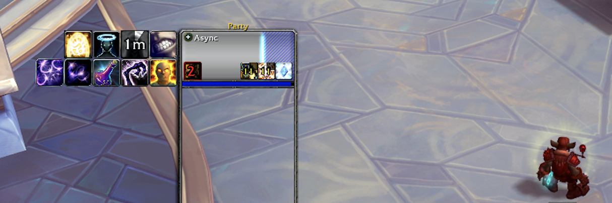

# Overshields

Overshields is a fork of the abboned addon DerangementShieldMeters by Derangement.
Ever wonder how much shield is still left, several hits after you cast Power Word: Shield on someone with full health, or use Death Strike to heal yourself as a tank?
Overshields will provice permanent feedback on total shielding amounts regardless of whether the shielded person's HP is full or not.

Works with blizzard's default Player, Target, Focus, Party, and Raid frames, as well as any custom frames that use their health prediction functions.

## Installation

### Addon Manager

Paste `https://github.com/casperstorm/overshields` into a addon manager which supports installs from GitHub.

### Manually

Download the [latest release](https://github.com/casperstorm/overshields/releases/latest) and extract the `.zip` to your AddOns folder.

## License

Overshields is released under the [MIT License.](https://github.com/casperstorm/overshields/blob/master/LICENSE)
